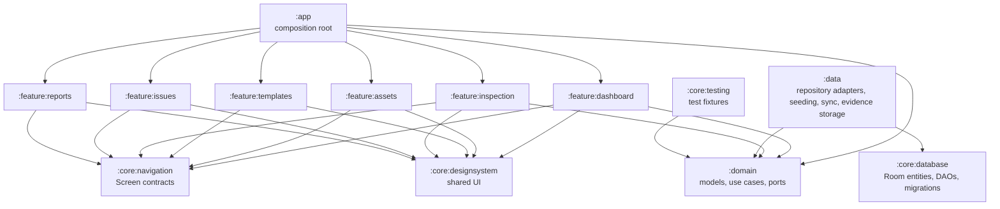
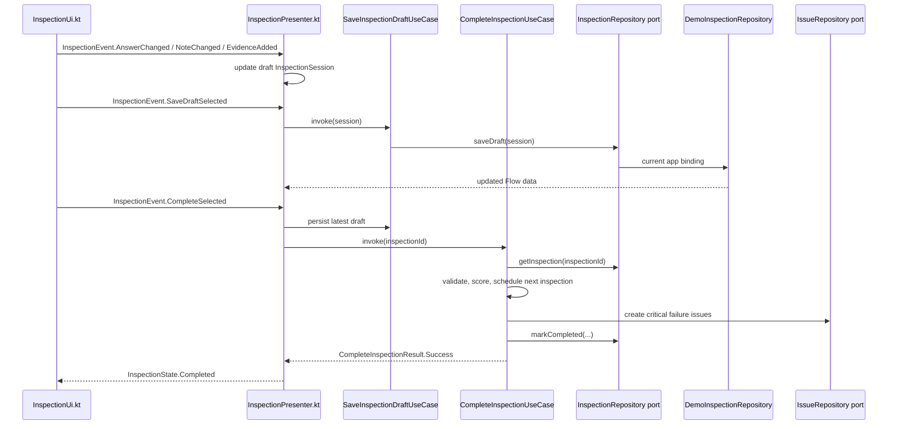

# FieldFlow Clean Architecture Seminar Guide

## 1. What FieldFlow Is

FieldFlow is an offline-first Android inspection and maintenance app for facilities, labs, classrooms, and equipment. The intended users are inspectors, maintenance coordinators, and students demonstrating an architecture that can support real inspection workflows.

The main workflow is:

1. Choose an asset or location.
2. Select an inspection template.
3. Complete checklist items with pass, fail, not-applicable, measured values, notes, and evidence references.
4. Save a draft, review validation, complete the inspection, calculate a score, create maintenance issues for failures, and prepare report data.

The domain is meaningful because the app is not just CRUD. It owns rules such as required checklist answers, critical-failure evidence, weighted scoring, lifecycle status, next inspection scheduling, and report eligibility.

## 2. Architecture Name

FieldFlow uses **Circuit-Based Feature-Modular Clean Architecture**.

This is a combination of complementary patterns:

- Clean Architecture defines system boundaries and dependency direction.
- Feature modularization enforces ownership and compile-time isolation.
- Slack Circuit structures the Presentation Layer.
- Offline-first Data adapters handle Room, persistence, file storage, and synchronization concerns.

Circuit is not a replacement for Clean Architecture. Circuit organizes screens, presenters, state, events, and Compose UI inside the outer Presentation Layer. Clean Architecture still controls which layer owns business rules and which layer may depend on implementation details.

## 3. High-Level Module Diagram



The current runtime app assembles deterministic demo repositories in `app/src/main/java/com/topic11/cs426/FieldFlowCompositionRoot.kt`. The Room adapter exists in `data/src/main/kotlin/com/topic11/cs426/data/RoomInspectionRepository.kt`, but it is not the active app binding.

## 4. Dependency Rule

The intended dependency rule is:

```text
Feature -> Domain <- Data
```

Source-code dependencies point inward because Domain owns business policy. Presentation can ask Domain to perform work, and Data can implement Domain ports, but Domain does not import Android, Compose, Circuit, Room, Data, or feature code.

Evidence:

- `domain/build.gradle.kts` is a Kotlin/JVM module, not an Android module.
- `feature/inspection/build.gradle.kts` depends on `:domain`, `:core:navigation`, and `:core:designsystem`, not `:data`.
- `data/build.gradle.kts` depends on `:domain` and `:core:database`.
- `domain/src/main/kotlin/com/topic11/cs426/domain/repository/InspectionRepository.kt` defines the port that both demo and Room adapters implement.

## 5. Responsibility of Every Module

`:app` is the composition root. It owns `MainActivity.kt`, `FieldFlowCompositionRoot.kt`, concrete repository selection, use-case construction, and Circuit factory registration.

`:domain` owns business models, use cases, and repository/export/storage ports. Important files include `InspectionSession.kt`, `InspectionTemplate.kt`, `InspectionScore.kt`, `ValidateInspectionUseCase.kt`, `CompleteInspectionUseCase.kt`, and `GenerateInspectionReportUseCase.kt`.

`:data` owns infrastructure adapters for Domain ports. Important files include `RoomInspectionRepository.kt`, `FakeInspectionRepository.kt`, `FieldFlowSampleDataSeeder.kt`, `AndroidEvidenceStore.kt`, and `FakeRemoteSyncAdapter.kt`.

`:core:database` owns the Room boundary: `FieldFlowDatabase.kt`, `DatabaseEntities.kt`, DAOs, migrations, schema JSON, and database tests.

`:core:navigation` owns typed Circuit screen contracts in `FieldFlowScreens.kt` so features can navigate without importing each other.

`:core:designsystem` owns shared Compose UI primitives such as `FieldFlowTheme.kt`, `FieldFlowTopAppBar.kt`, `InspectionSummaryCard.kt`, and `FeaturePlaceholder.kt`.

`:core:testing` owns reusable fakes and fixtures used by tests, such as `RecordingInspectionRepository.kt` and `InspectionTestFixtures.kt`.

`:feature:dashboard` owns Dashboard presentation: `DashboardPresenter.kt`, `DashboardUi.kt`, Circuit factories, and Dashboard-specific components.

`:feature:inspection` owns Inspection presentation: `InspectionPresenter.kt`, `InspectionUi.kt`, contracts, and Circuit factories.

`:feature:assets`, `:feature:templates`, and `:feature:issues` own currently navigable placeholder boundaries. Their runtime UI is intentionally honest that the feature workflow is not implemented.

`:feature:reports` owns a Reports placeholder destination. Domain report models and ports exist, but runtime report history and PDF/JSON adapters are not wired.

## 6. One Complete End-to-End Flow

The current runtime inspection completion flow is implemented through Domain use cases and demo repository adapters:



The Room variant of the adapter path is implemented and tested separately:

```text
RoomInspectionRepository
-> FieldFlowDatabase
-> InspectionDao / CatalogDao / IssueDao / SyncDao
-> Flow
-> Domain model mapper
```

That Room path is not the default runtime graph until `FieldFlowCompositionRoot.kt` selects it.

## 7. Business Rules in Domain

Implemented Domain rules include:

- Required checklist answers in `ValidateInspectionUseCase.kt`.
- Critical-failure evidence requirements in `ValidateInspectionUseCase.kt`.
- Weighted score calculation and Not Applicable exclusion in `CalculateInspectionScoreUseCase.kt`.
- Completion orchestration in `CompleteInspectionUseCase.kt`.
- Maintenance issue creation for failed items in `CreateMaintenanceIssueUseCase.kt`.
- Recurrence scheduling in `ScheduleNextInspectionUseCase.kt`.
- Report eligibility for completed inspections in `GenerateInspectionReportUseCase.kt`.

These rules do not belong in UI, Presenter, DAO, or repository adapters because they are business policy. If they lived in Compose UI, they would be hard to test without Android. If they lived in DAO SQL, the app would duplicate or lose behavior when the storage adapter changes.

Evidence tests live in `domain/src/test/kotlin/com/topic11/cs426/domain/DomainBusinessRulesTest.kt`.

## 8. Ports and Adapters

Domain ports include:

- `InspectionRepository.kt`;
- `TemplateRepository.kt`;
- `AssetRepository.kt`;
- `IssueRepository.kt`;
- `EvidenceStore.kt`;
- `ReportExporter.kt`.

Adapters include:

- `DemoInspectionRepository`, `DemoTemplateRepository`, `DemoIssueRepository`, and `DemoAssetRepository` in `:app` for repeatable seminar runtime data.
- `RoomInspectionRepository.kt` in `:data` for Room-backed inspection persistence.
- `FakeInspectionRepository.kt` and `FakeRemoteSyncAdapter.kt` in `:data` for deterministic tests and sync simulation.
- `AndroidEvidenceStore.kt` and `EvidenceFileStorage.kt` in `:data` for Android file-backed evidence storage infrastructure.

The important point is replacement. `:feature:inspection` uses `CompleteInspectionUseCase`, not `RoomInspectionRepository`. Switching from demo repositories to Room-backed repositories should happen in `:app`, with Domain and feature modules unchanged.

## 9. Slack Circuit Presentation

Slack Circuit structures presentation as:

```text
Screen -> Presenter -> immutable UiState -> UiEvent -> Compose UI
```

Example from Inspection:

- Screen: `InspectionScreen` in `core/navigation/src/main/kotlin/com/topic11/cs426/core/navigation/FieldFlowScreens.kt`.
- Presenter: `InspectionPresenter.kt`.
- State/events: `InspectionContracts.kt`.
- UI: `InspectionUi.kt`.
- Factories: `InspectionFactories.kt`.

The Presenter observes Domain flows, calls use cases, reacts to UI events, and emits immutable state. Compose renders state and emits events through `eventSink`; it does not construct repositories or call DAOs.

## 10. Feature-First Modularization

Feature modules own presentation for their slice. This helps FieldFlow because separate team members can work on Dashboard, Inspection, Reports, Issues, Templates, and Assets without sharing one large app package.

The compile-time boundary matters: a feature cannot import `:data` unless its Gradle file adds that dependency. Current feature Gradle files do not do that, so repository implementation details stay outside presentation.

Team ownership is documented in `docs/architecture/TEAM_OWNERSHIP.md`.

## 11. Offline-First Architecture

The offline-first infrastructure is implemented below the current runtime graph:

- Room local schema: `core/database/src/main/kotlin/com/topic11/cs426/core/database/FieldFlowDatabase.kt`.
- Entities: `core/database/src/main/kotlin/com/topic11/cs426/core/database/entity/DatabaseEntities.kt`.
- DAOs: `InspectionDao.kt`, `CatalogDao.kt`, `IssueDao.kt`, and `SyncDao.kt`.
- Repository adapter: `data/src/main/kotlin/com/topic11/cs426/data/RoomInspectionRepository.kt`.
- Mappers: `InspectionSessionMapper.kt` and `InspectionSummaryMapper.kt`.
- Migration and persistence tests: `FieldFlowMigrationTest.kt`, `DraftRecoveryTest.kt`, and `PendingSyncTest.kt`.

The architecture supports Room as local source of truth, Flow observation, persisted drafts, and pending synchronization state. The app does not currently prove those runtime behaviors because `:app` still binds demo repositories.

## 12. Testing Strategy

FieldFlow uses several levels of tests:

- Pure Domain tests: `DomainBusinessRulesTest.kt`, `ObserveInspectionSummariesUseCaseTest.kt`, and `ObserveInspectionUseCaseTest.kt`.
- Database and DAO tests: `FieldFlowDatabaseTest.kt`, `DraftRecoveryTest.kt`, `PendingSyncTest.kt`, and `FieldFlowMigrationTest.kt`.
- Data adapter tests: `RoomInspectionRepositoryTest.kt`, `InspectionSummaryMapperTest.kt`, `FieldFlowSampleDataSeederTest.kt`, `AndroidEvidenceStoreTest.kt`, and `FakeRemoteSyncAdapterTest.kt`.
- Presenter tests: `DashboardPresenterTest.kt`, `InspectionPresenterTest.kt`, and `ReportsPresenterTest.kt`.
- Runtime UI/instrumentation coverage is limited to `app/src/androidTest/java/com/topic11/cs426/FieldFlowNavigationSmokeTest.kt` and should be completed manually with `docs/demo/FINAL_MANUAL_ACCEPTANCE_CHECKLIST.md`.

The strongest tests are Domain, DAO, mapper, repository, and Presenter tests. Manual runtime acceptance remains necessary because this review does not run an emulator.

## 13. Why This Architecture Is Better for FieldFlow

Compared with a monolithic Android app or single `:app` module, FieldFlow's structure has more setup cost but stronger boundaries. A single module would be faster at the start, but imports between UI, Room, and business rules would be easier to mix accidentally.

Compared with traditional MVVM where ViewModels call repositories or DAOs directly, FieldFlow has more use cases and interfaces. That is acceptable here because inspection validation, scoring, evidence requirements, draft state, issue creation, and report eligibility are business rules that need pure tests and adapter replacement.

Compared with a simple layered architecture without Gradle modules, FieldFlow has stronger enforcement. Packages and naming can express intent, but Gradle module dependencies prevent many accidental imports at compile time.

This architecture is not universally superior. A tiny CRUD prototype might be better as a single app module with ViewModels and a local repository. FieldFlow benefits from stronger boundaries because it has non-trivial rules, offline-first storage, multiple feature teams, report/evidence adapters, and future replacement needs.

## 14. Benefits Demonstrated by the Repository

Separation of concerns: `ValidateInspectionUseCase.kt` and `CalculateInspectionScoreUseCase.kt` contain rules while `InspectionUi.kt` renders state.

Testability: Domain tests run on the JVM without Android.

Maintainability: Dashboard and Inspection presenters depend on use cases, not Room or files.

Scalability: each feature module has its own Gradle boundary and package.

Replaceability: `InspectionRepository.kt` is implemented by demo/test adapters and by `RoomInspectionRepository.kt`.

Parallel team development: `docs/architecture/TEAM_OWNERSHIP.md` maps feature and layer ownership.

Compile-time safety: feature build files do not depend on `:data`.

UI-framework isolation: Domain has no Circuit or Compose imports.

Database isolation: Room entities and DAOs are contained in `:core:database` and mapped in `:data`.

## 15. Costs and Trade-Offs

The costs are real:

- more Gradle modules;
- more interfaces;
- mapping between Room records and Domain models;
- more composition-root wiring;
- more tests and fixtures;
- higher learning curve for Circuit plus Clean Architecture;
- risk of over-engineering if the app stayed small.

For FieldFlow, the trade-off is acceptable because the app's central value is business policy and offline behavior, not just screens over tables. The seminar also benefits because the codebase can demonstrate dependency inversion, replaceable adapters, and testable Domain rules.

## 16. What Would Be Simpler for a Tiny App

A tiny CRUD prototype could use one Android module, Compose screens, ViewModels, and a repository that directly uses Room. That would reduce files and Gradle configuration.

FieldFlow chose a larger architecture because the proposal includes inspections, validation, scoring, evidence, issue creation, offline drafts, pending sync, and report/export boundaries. Those concerns become harder to keep clean in a tiny structure as the app grows.

## 17. Demo Script for Architecture

Use this 5-8 minute architecture demonstration:

1. Open Dashboard and show inspection summaries.
2. Open an inspection and change answers.
3. Save draft, review, trigger validation, add required evidence, and complete.
4. Trace `InspectionUi.kt -> InspectionPresenter.kt -> CompleteInspectionUseCase.kt -> InspectionRepository.kt -> DemoInspectionRepository`.
5. Show `DomainBusinessRulesTest.kt` proving validation/scoring rules without Android.
6. Show `feature/inspection/build.gradle.kts` has no `:data` dependency.
7. Show `RoomInspectionRepository.kt` as a replaceable adapter for the same Domain port.
8. Explain offline-first infrastructure and the current runtime limitation: Room is implemented and tested but not selected in `:app`.
9. End with trade-offs: more modules and mapping, but clearer boundaries and testable rules.

## 18. Suggested Speaker Division

Four-person split:

1. Product and workflow: proposal scope, users, Dashboard, Inspection journey.
2. Clean Architecture and Domain: dependency rule, use cases, ports, business-rule tests.
3. Data and offline-first: Room schema, DAOs, repository adapter, migrations, draft and sync tests.
4. Presentation and demo: Slack Circuit, feature modules, navigation, manual runtime scope, trade-offs.

## 19. Likely Questions and Strong Answers

**Why not put everything in one app module?**
That would be faster initially, but FieldFlow has multiple features, offline persistence, evidence/report adapters, and business rules. Separate modules make accidental imports harder and improve team ownership.

**Is this just MVVM?**
No. Circuit Presenters are part of presentation, similar in responsibility to ViewModels, but the architecture boundary is broader. Business rules are in Domain use cases, and repositories are ports owned by Domain.

**Why use Circuit instead of Android ViewModel/navigation?**
Circuit gives typed screens, presenters, UI factories, and one-way state/event flow. FieldFlow still uses Clean Architecture underneath; Circuit only structures the Presentation Layer.

**Why define repository interfaces in Domain?**
Because Domain owns the business need: observe inspections, save drafts, complete inspections, load templates, create issues, export reports, and store evidence. Data only supplies implementations.

**Why is Room not referenced in Domain?**
Room is infrastructure. Domain should be testable on the JVM and should not change if storage moves from Room to another adapter.

**Why not call DAO directly from Presenter?**
That would couple UI workflow to database details and spread validation/scoring decisions into presentation. The Presenter should call use cases and render state.

**Does Clean Architecture add too much boilerplate?**
For a tiny app, maybe. For FieldFlow, the extra ports, mappers, and modules pay for themselves because validation, scoring, offline state, evidence, and reports need stable boundaries.

**How does offline-first work?**
The implemented data path uses Room as local source of truth, DAOs for reads/writes, repository mapping to Domain models, and Flow observation. Current runtime app still uses demo repositories, so offline-first is demonstrated through Data/Database code and tests unless Room is wired in `:app`.

**How can adapters be replaced?**
Replace the concrete repository construction in `FieldFlowCompositionRoot.kt`. Features and Domain keep the same use cases and ports.

**How do Gradle modules enforce the architecture?**
If `:feature:inspection` does not declare `implementation(project(":data"))`, it cannot compile imports from Data. The same applies to Domain purity through its Kotlin/JVM build.

**What happens when a business rule changes?**
Change the Domain use case and Domain tests first. Presentation should mostly keep rendering state and emitting events, while Data should keep mapping and persistence behavior.

**What are the architecture's limitations?**
Runtime app wiring still uses demo repositories, report exporters are ports without concrete PDF/JSON UI wiring, Assets/Templates/Issues are placeholders, and evidence storage infrastructure is not fully connected to the inspection UI.

## 20. Final Architecture Summary

FieldFlow demonstrates Circuit-Based Feature-Modular Clean Architecture: feature modules own UI, Domain owns inspection rules and ports, Data implements replaceable adapters, Room is isolated behind repositories, and `:app` assembles the graph. The architecture is valuable because FieldFlow has real business rules and offline-first concerns, but the seminar should clearly state which parts are runtime demo behavior and which parts are implemented infrastructure awaiting app wiring.
